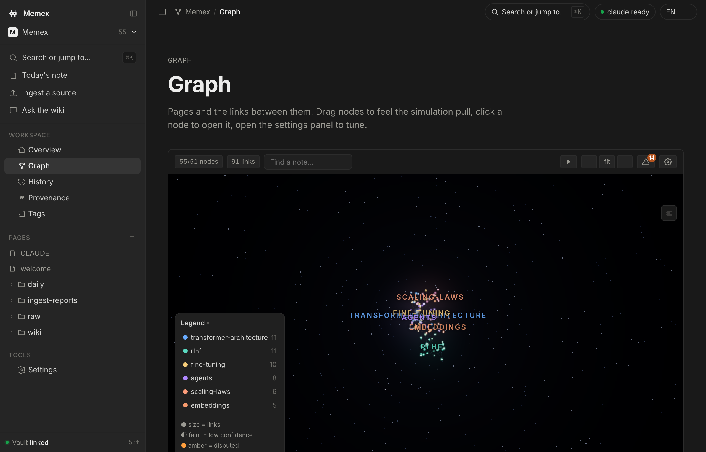
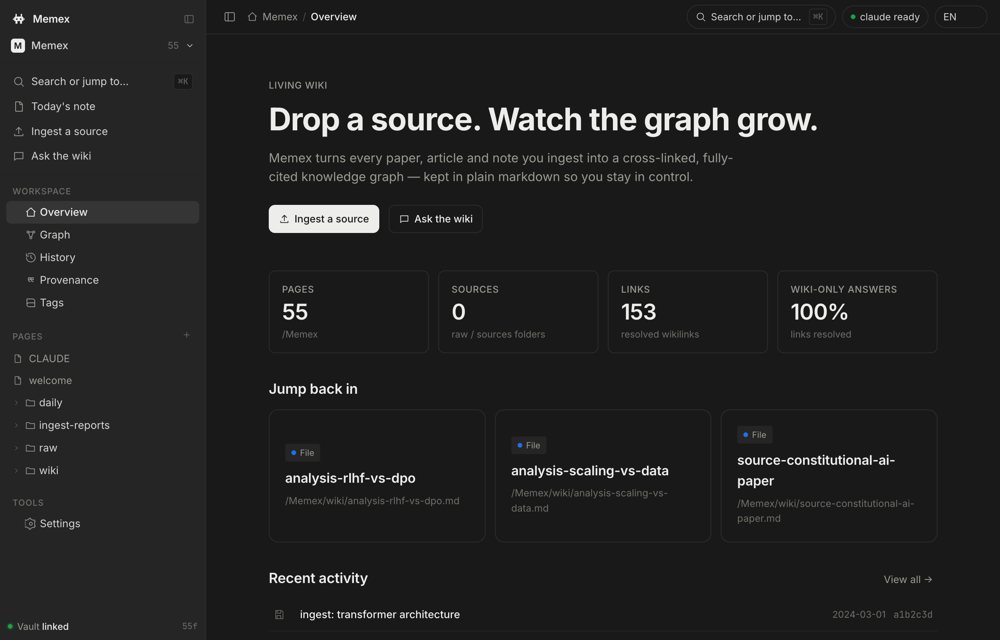
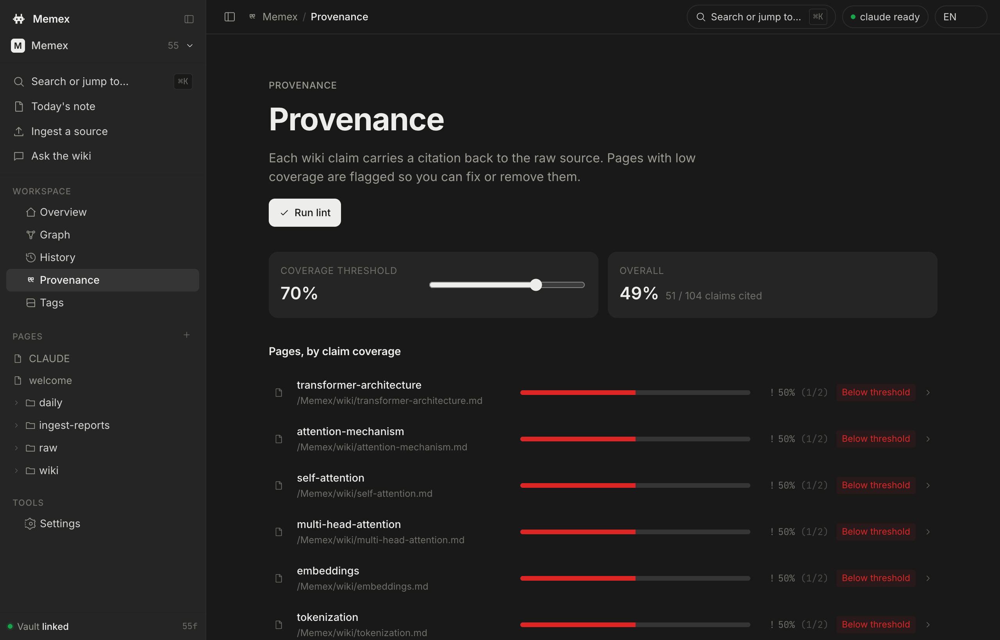
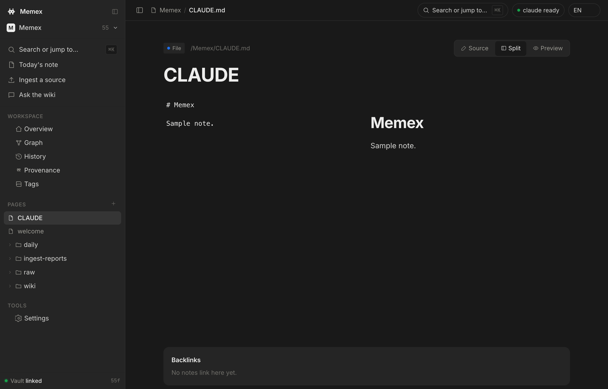
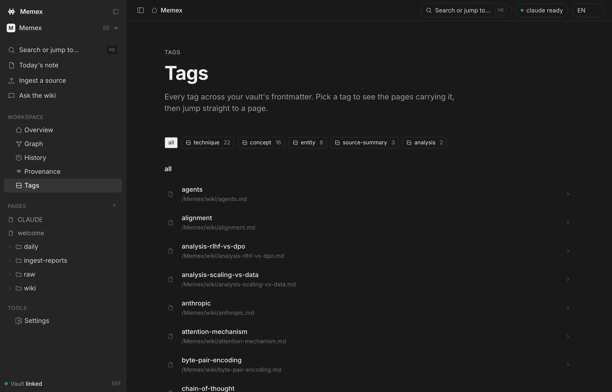
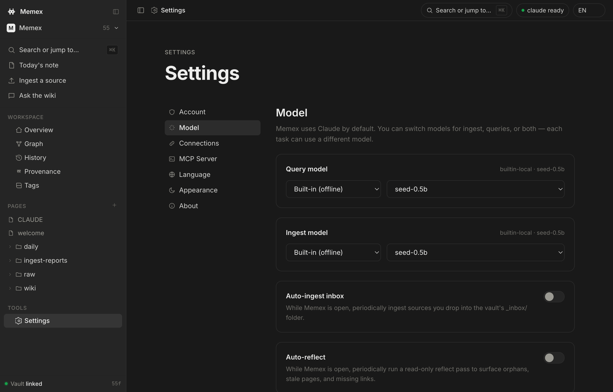

<div align="center">

<br />


<h1>Memex</h1>

<p><strong>A personal knowledge base that writes itself.</strong></p>

<p>
Drop a source. Claude does the bookkeeping.<br/>
Your knowledge compounds — in plain markdown you own.
</p>

<p>
<a href="#install"></a>
&nbsp;

&nbsp;

&nbsp;

&nbsp;
<a href="README-ko.md"></a>
</p>

<br />

<p>
<em>"Obsidian is the IDE. Claude is the programmer. The wiki is the codebase."</em>
</p>

<br />



<sub><em>The Graph view — a "calm cosmic web". Every note is a star sized by its links, each community its own hue with an auto-named cluster label, <code>[[wikilinks]]</code> are faint grey connective tissue, and only true hubs bloom. This is the seeded ~50-note starter vault you get on first launch.</em></sub>

</div>

---

## Why?

Most LLM-plus-documents setups **re-derive knowledge on every query**. RAG finds chunks, the model stitches an answer, nothing is kept. Ten queries against the same docs → ten rediscoveries.

**Memex inverts this.** You add a source once. Claude reads it, integrates it into a persistent wiki, flags contradictions against older pages, wires up citations, and commits the result. By query #10 the wiki itself answers — the bookkeeping already happened.

Based on [Andrej Karpathy's LLM Wiki pattern](https://gist.github.com/karpathy/442a6bf555914893e9891c11519de94f). Named for [Vannevar Bush's 1945 Memex](https://en.wikipedia.org/wiki/Memex).

---

## Two surfaces, one wiki

Memex ships as a native desktop app. A second surface exists for programmatic access from another Claude client.

| Surface | What it is | When to use |
|---|---|---|
| **Memex desktop app** (`app/`) | Tauri 2 + React. Ships as a `.dmg` / `.exe`. Bundles its own vault, talks to any of 5 LLM providers (CLI + 4 HTTP APIs + Ollama). | **Default. Use this.** |
| **MCP server** (`mcp-server/`) | 26 tools exposed via the Model Context Protocol. | Drive Memex from Claude Desktop / Claude Code / any MCP client. |

Both share the same vault layout (`raw/ wiki/ daily/ ingest-reports/`) and never lock your data. Plain markdown on disk, always.

---

## Install

### Desktop app (recommended)

Grab the bundle for your platform from the
**[latest release](https://github.com/cmblir/Memex/releases/latest)**:

- **macOS** (universal — Apple Silicon + Intel): `Memex_0.1.0_universal.dmg`
- **Windows x64**: `Memex_0.1.0_x64-setup.exe` (NSIS installer)

Mount/run, drag to Applications.

> [!note] First launch — installers are unsigned for v0.1.0
> Both bundles are **unsigned**, so the OS will warn on first open. This is expected; unblock once:
>
> - **macOS** (Gatekeeper "unidentified developer") — right-click the app → **Open** → **Open**; or run `xattr -dr com.apple.quarantine /Applications/Memex.app`; or go to **System Settings → Privacy & Security → "Open Anyway"**.
> - **Windows** (SmartScreen "Windows protected your PC") — click **More info** → **Run anyway**.

On first launch Memex creates
`~/Documents/Memex/` and seeds it with:

```
~/Documents/Memex/
├── CLAUDE.md            ← maintenance rules for Claude
├── welcome.md           ← onboarding note
├── raw/                 ← drop sources here (immutable)
├── wiki/                ← Claude-maintained pages
│   ├── index.md
│   ├── log.md
│   └── …                ← interconnected starter notes (LLM concepts)
├── daily/               ← daily notes (YYYY-MM-DD.md)
└── ingest-reports/      ← WHY reports per ingest
```

The `wiki/` ships with a small set of interconnected starter notes so the
**Graph** view is populated on first launch — delete them anytime.

To use a different folder (e.g. an existing Obsidian vault), open
Settings → Account → Change…

### MCP server (optional)

Requires Python 3.10+ (stdlib only) and the [Claude Code CLI](https://docs.anthropic.com/en/docs/claude-code).

```bash
git clone https://github.com/cmblir/memex.git
cd memex
bash mcp-server/install.sh    # MCP server for Claude Desktop/Code
```

---

## Screenshots

<p align="center">

<br/>
<sub><em>The Graph view idling on a slow auto-orbit — community-colored stars, auto-named cluster labels, faint grey <code>[[wikilink]]</code> tissue and cosmic-dust haze. Grab any star and the d3-force-3d sim re-heats; its neighbours follow and spring back on release.</em></sub>
</p>

<br/>

<table>
<tr>
<td width="50%"></td>
<td width="50%"></td>
</tr>
<tr>
<td align="center"><sub><strong>Overview</strong> — stats, jump-back, recent activity</sub></td>
<td align="center"><sub><strong>Provenance</strong> — citation coverage per page</sub></td>
</tr>
<tr>
<td width="50%"></td>
<td width="50%"></td>
</tr>
<tr>
<td align="center"><sub><strong>Reader</strong> — source / split / preview + backlinks</sub></td>
<td align="center"><sub><strong>Tags</strong> — browse the vault by frontmatter tag</sub></td>
</tr>
<tr>
<td width="50%"></td>
<td width="50%"></td>
</tr>
<tr>
<td align="center"><sub><strong>Settings</strong> — separate Query / Ingest models, cost budget, auto-reflect</sub></td>
<td></td>
</tr>
</table>

> Captured from the app on its seeded starter vault. A fresh install ships
> ~50 interconnected starter notes (an LLM knowledge map), so the Graph looks
> like this on day one — delete them anytime.

---

## The desktop app

Routes in the left sidebar — Overview, Graph, History, Provenance, Tags, **Study**, **Schedules**, Settings, plus Ingest and Ask. Cmd/Ctrl-K opens the command palette (with semantic hits), Cmd/Ctrl-B toggles the sidebar. On first launch a 3-step onboarding wizard walks you through opening a vault → adding a source → asking a question; the whole app is responsive down to 320px (the sidebar goes off-canvas on narrow screens).

### Overview

Vault stats (file count, resolved wikilinks, ratio), recent git activity, jump-back cards to your most-edited notes.

### Ingest

1. Drop a file or paste raw text → Memex writes it to `raw/<slug>.md`.
2. The active **ingest model** is invoked (Claude CLI by default) with the vault as cwd.
3. Claude reads the source, finds affected wiki pages, writes citations, creates/updates `wiki/source-<slug>.md`, appends `wiki/log.md`, and files an `ingest-reports/<datetime>-<slug>.md` with the WHY.
4. The tree and graph refresh.

**Inputs are multimodal** — PDFs, plain text, Office documents (`.docx` / `.pptx`), spreadsheets (`.xlsx` / `.xls` / `.ods`), **images** (described by a vision provider — Anthropic / OpenAI / Google API), **audio & video** (transcribed by an installed `whisper` CLI — openai-whisper or whisper.cpp; no model is bundled), and **YouTube URLs** (the transcript is fetched from the watch page) are all reduced to markdown before step 1. A **local embedding index** (bundled SEED model, or an opt-in provider) is built over the wiki so Ask retrieves the most relevant pages, the command palette surfaces semantic hits, and each page gets a **Related notes** panel; reindex from Settings.

### Ask

A chat surface that answers questions about your wiki. The active **query model** runs from the vault root with a preamble nudging it to use Read/Grep tools on `wiki/` first, falling back to `raw/`. Conversation history is preserved per session; non-tool providers get the top-K semantically-retrieved pages inlined so they answer from real content.

**Agent mode** (an Ask/Agent toggle) turns a tool-capable provider (Anthropic API or an OpenAI-compatible provider) into an autonomous researcher: it plans and calls read tools over the vault — search, read pages, traverse links, provenance — streaming a collapsible step trace, then answers with citations. Optional **write tools** (create/update page) are confirmed per call and never touch `raw/`; reusable **task-agent presets** save as portable `agents/<slug>.md` files.

**Audio overview** turns an answer's cited pages (or a Reader page + neighbours) into a grounded two-host spoken "deep dive" — a cited dialogue saved to `audio/` and played back offline through the OS voices (Web Speech API, no bundled engine).

### Graph

Full vault link graph rendered as a **3D "calm cosmic web"** with **three.js** (WebGL) over a **d3-force-3d** layout — the same force family Obsidian uses (`forceLink` + `forceManyBody` + `forceX/Y/Z` + collision), with each link's strength normalised by node degree and a light community-clustering force that gathers each Louvain community into its own softly-lit region. The design rule is *brightness is earned by density*: 80–90% of the frame stays dark void, node size follows a log-degree scale, and **only true hub cores bloom** (selective bloom — edges, pulses, starfield and labels are structurally bloom-proof, so a dense cluster never washes out to white). Edges are `[[wikilinks]]` drawn as faint **grey connective tissue** (structure is grey; signal is the colored stars). **Every note is shown, including link-less orphans**, and unresolved links appear as dim **ghost nodes** — just like Obsidian (toggle *Show orphans* / *Existing files only*).

The six largest communities get a hue from a curated 6-color palette (the rest stay neutral), each with an **auto-named cluster label** floating at its centroid when you're zoomed out — a reverse semantic zoom that hands off to per-node labels as you push in. Labels default to the community's top-degree note; the bundled offline model upgrades them to a short topic name in the background (cached, with the note-name as a permanent fallback). An in-canvas **legend** (bottom-left) lists the top communities and the size/dim/amber/grey encodings; click a swatch to isolate that community.

Link resolution matches Obsidian: `[[note]]`, `[[note|alias]]`, `[[note#heading]]`, `![[embeds]]`, and links to non-`.md` files such as Obsidian **Bases** (`[[Table.base]]`) all resolve.

**Drag to orbit** the camera and scroll to zoom; the mesh idles with a slow auto-rotate that pauses while you interact and resumes after a few seconds. **Grab a star and the simulation re-heats** — its neighbours follow in 3D and it springs back on release. **Click a node** to isolate its 1-hop neighbourhood (double-click for 2 hops); each isolation pushes onto a focus stack you pop with **Esc**, a click on empty space, or the breadcrumb chips. **Cmd/Ctrl-click a second node** to light the shortest path between two notes as bright filaments. The file tree and graph **auto-refresh** when files change outside the app. At 60 fps up to ~10k nodes; past 5k it drops into a performance mode (ambient layers off) with a banner.

A right-side settings drawer (gear icon):

- **Filters** — live search by filename, tag chips, folder dropdown, toggles for *Show orphans* and *Existing files only*.
- **Display** — *Arrows*, *Text fade threshold*, *Node size*, *Link thickness*, a **Glow** slider, an **Ambient motion** toggle (one switch for auto-rotate + pulses + breathing), and a **▶ Play timelapse** button.
- **Layout** — three presets (**Galaxy** / **Loose web** / **Dense**) cover the common cases; the raw d3-force sliders (*Center / Repel / Link / Link distance / Cluster force*) live under an **Advanced** accordion.

**Timelapse** (toolbar ▶ or the drawer button) reveals notes oldest-to-newest by file mtime at their settled positions — edges appear as each note connects up, so you watch the graph build itself in the order you actually wrote it.

Drawer state and every slider position persist to localStorage. Both light and dark themes are calibrated; on light the stars darken to legible ink rather than blooming out.

### History

Reads `git log` from the vault directory and renders each commit with subject, hash, date, and `+/~` line counts. HEAD is marked. If the vault isn't a git repo yet, an inline tip explains how to `git init`.

### Provenance

Per-page **citation coverage** — total claim lines vs cited claim lines. Sortable by lowest coverage, with a slider threshold that flags pages below target.

**Run lint** sends the CLAUDE.md lint checklist (structure / citation / connection / freshness) to the active query model. On the Claude CLI it **streams the report live** as it's written rather than spinning until done. (The MCP server also ships a no-LLM `lint_citations` for an instant regex pass.)

### Tags

Every page grouped by its frontmatter `tags` — a count-weighted tag cloud; click a tag to filter the page list, click a page to open it.

### Study

Active recall over your wiki. **"Make cards"** on any page generates flashcards with the LLM stack (offline with the bundled model); they're saved as plain markdown in `cards/<deck>.md` — Obsidian-`spaced-repetition` syntax with an **FSRS** scheduling trailer, so review state round-trips losslessly. The Study route reviews due cards (front → reveal → grade Again/Hard/Good/Easy → the FSRS scheduler advances the interval → saved to disk) and runs generated multiple-choice quizzes. A sidebar badge shows how many cards are due.

### Schedules

Recurring, unattended digests. Define a schedule — a free **query**, a **"what changed"** summary (folds in `git log`), a **staleness** sweep (orphans / under-cited / contradictions), or a **topic** tracker — on a cadence (daily / weekly / monthly / every N hours). While the app is open an in-app timer fires due schedules; each writes a plain-markdown note into `digests/` with source citations. **Run now** triggers one on demand and links you to the latest digest. (App-closed runs via launchd/cron, and native notifications, are planned follow-ups.)

### Settings

Six sub-tabs:

- **Account** — current vault path; **Change…** to point at any folder, and **Make this an independent Obsidian vault** (scaffolds an `.obsidian/` so the folder opens standalone in Obsidian).
- **Model** — separate provider+model dropdowns for **Query** and **Ingest**, a monthly **cost budget** (threshold + current-month spend, per model; over-budget HTTP calls are blocked), an **auto-ingest** toggle for the `_inbox/` folder, and an **auto-reflect** toggle that periodically asks for wiki-improvement suggestions.
- **Connections** — connect/disconnect any of:
  - **Built-in (offline)** — Powered by HyperCLOVA X. SEED 0.5B ships inside the app (in-process llama.cpp, Metal on Apple silicon). No install, no key, works offline — classification and light queries; pick a cloud provider for high-quality ingest. Model © NAVER Corp., HyperCLOVA X SEED Model License.
  - **Claude Code (CLI)** — uses your Pro/Max subscription. No key required, just `claude` on PATH.
  - **Anthropic API** — direct `/v1/messages`.
  - **OpenAI API** — `/v1/chat/completions`. Live model list via `/v1/models`.
  - **Google AI** — Gemini family via `:generateContent`.
  - **Ollama** — local `http://localhost:11434`. Auto-detects installed models.
  - **OpenRouter** — `/api/v1/chat/completions`. Live catalog of 80+ models.
  
  API keys go straight to the OS keychain (macOS Keychain / Windows Credential Manager / freedesktop Secret Service) under the service name `dev.cmblir.memex`. **Never written to disk in plaintext.**
- **Language** — EN / 한국어 / 日本語 (UI). The drafting language for the model is independent.
- **Appearance** — light / dark / system.
- **About** — version + about text.

### Page reader (any vault file)

Click a file in the sidebar → opens with three modes:

- **Source** — CodeMirror 6 with markdown highlighting, `[[wikilink]]` autocomplete (start typing `[[` and pick from a popup of every note in the vault), `⌘S` to save, 2-second idle autosave.
- **Preview** — markdown-it render with wikilinks as live buttons.
- **Split** — both side by side, edits propagate to the preview live.

A **Backlinks** panel at the bottom lists every note that links here, a **Related notes** panel lists the nearest pages by embedding similarity, and header actions let you **Make cards** (Study) or generate an **Audio overview** from this page and its neighbours.

Opening a **`raw/` PDF** shows an in-app **pdf.js** viewer (bundled worker, no network): select text → **Highlight & cite** mints a colour-coded highlight and inserts a `[[pdf::<stem>#p<page>:<id>]]` pinpoint link into your note. Highlights persist in an external sidecar (`wiki/.annotations/<stem>.json`) so `raw/` stays immutable; clicking a pinpoint link opens the PDF at that spot, and clicking a highlight jumps to the citing note.

Right-click any tree node for **New note / New folder / Rename / Delete**. Cmd-K jumps to any file by stem name.

---

## The pattern

```
   ~/Documents/Memex/    Your vault (or any folder you point Memex at)
     ├─ raw/             Original sources. Immutable.
     │    │
     │    ▼  Ingest page
     ├─ wiki/            Claude-maintained pages.
     │                   Inline citations [^src-*]. Cross-referenced.
     │                   Frontmatter schema (CLAUDE.md per vault).
     ├─ daily/           Daily notes (Today's note button).
     ├─ ingest-reports/  WHY each ingest decided what it decided.
     ├─ cards/           Flashcard decks (Study) — markdown + FSRS state.
     ├─ audio/           Audio-overview transcripts.
     ├─ agents/          Saved task-agent presets.
     ├─ digests/         Scheduled digest notes.
     └─ CLAUDE.md        Maintenance rules Memex seeds on first launch.
     ▼
   Memex desktop + Obsidian (optional) + your shell / git client
   All three see the same files. Memex never locks the vault.
```

- **You**: curate sources, ask questions, draw the boundaries.
- **Claude**: summarise, cross-reference, cite, detect contradictions, commit.
- **The wiki**: compounds with every ingest.

---

## Talk to your wiki from outside the app

The desktop app exposes everything from inside its UI, but you may want the same vault accessible from **Claude Desktop / Claude Code** sessions running elsewhere. That's what the MCP server does.

**Easiest path — let the app do it.** The desktop app **bundles the MCP server and registers it for you**: open **Settings → MCP**, click *Install* (creates a private Python venv in the app's data dir) then *Register* (runs `claude mcp add` for you). The server then **follows whichever vault the app currently has open** — it reads an `active-vault` marker the app rewrites on every vault switch, so changing vaults in the app redirects MCP reads/writes automatically, with no re-registration. The manual steps below are for driving the server from a from-source checkout.

<details>
<summary><b>4-step MCP setup wizard (from source)</b></summary>

#### Step 1 — Install the server

```bash
bash mcp-server/install.sh
```

Creates `mcp-server/.venv` with the `mcp` SDK and prints the absolute paths you'll paste into your client config.

The 26 exposed tools:

| Group | Tools |
|---|---|
| **Read** | `list_projects` `get_instructions` `stats` `list_pages` `read_page` `search` (with `all_projects`) `folder_tree` `recent_log` `list_raw_sources` |
| **Write** | `add_raw_source` (warns on detected secrets) `create_page` `update_page` `create_folder` `git_commit` |
| **Inbox** | `list_inbox` `read_inbox_source` `archive_inbox_source` |
| **Quality (no-LLM)** | `lint_citations` `preview_page_update` `trust_report` `contradictions` `translation_report` |
| **Governance / multi-project** | `resolve_cross_links` (`[[slug::page]]`) `append_changelog` `export_project` `register_vault` |

#### Step 2 — Pick your client

**Claude Code (terminal CLI):**

```bash
claude mcp add --scope user memex \
  -- "$PWD/mcp-server/.venv/bin/python" "$PWD/mcp-server/memex_mcp.py"
claude mcp list                       # memex should appear
```

**Claude Desktop:**

> ⚠️ Quit Claude Desktop completely first (Cmd+Q on macOS).

Edit `~/Library/Application Support/Claude/claude_desktop_config.json`
(macOS) or `%APPDATA%\Claude\claude_desktop_config.json` (Windows):

```json
{
  "mcpServers": {
    "memex": {
      "command": "/Users/<you>/Memex/mcp-server/.venv/bin/python",
      "args": ["/Users/<you>/Memex/mcp-server/memex_mcp.py"]
    }
  }
}
```

#### Step 3 — Verify

> List my Memex projects.

Claude should call `list_projects` and reply.

#### Step 4 — Pin the schema (optional)

At the start of an ingestion-heavy chat:

> Call `memex.get_instructions` once. From now on treat factual content
> I share as wiki ingestion — write to the wiki with citations, ask
> before creating new pages, commit at the end.

</details>

The MCP server and the Memex desktop app share the same `wiki/` tree, so changes from either surface are immediately visible in the other.

---

## Build from source

### Desktop app

Prerequisites: Node 20+, Rust 1.77+, and the [Tauri prerequisites](https://tauri.app/start/prerequisites/) for your OS.

```bash
cd app
npm install
npm run tauri dev       # hot-reload dev window
npm run tauri build     # release bundle in src-tauri/target/release/bundle/
```

See [`app/README.md`](app/README.md) for the full development guide,
architecture diagram, and IPC surface.

### MCP server

Already covered above — no compilation needed, just Python 3.10+.

---

## Multi-project

The MCP server supports multiple independent wikis. Each lives under `projects/<slug>/` with its own `wiki/ raw/ CLAUDE.md .settings.json`.

Templates scaffold `wiki/` subfolders at creation time:

| Template | Default folders |
|---|---|
| `generic` | `sources entities concepts techniques analyses` |
| `llm-research` | `sources models techniques concepts entities benchmarks analyses` |
| `reading-log` | `sources authors ideas quotes reviews` |
| `personal-notes` | `daily topics people projects` |

Any project can also be registered as its **own standalone Obsidian vault** (`register_vault` / the Settings button scaffolds an `.obsidian/`), so you can open the whole repo as one vault *or* each project folder independently.

The desktop app focuses on a single open vault at a time. To switch vaults, use Settings → Account → Change.

---

## Repository layout

```
app/                       Memex desktop app (Tauri 2 + React)
  src/                       React frontend (TS)
  src-tauri/                 Rust shell + IPC
  README.md                  Desktop app docs
  PLAN.md / PROGRESS.md      Build history
mcp-server/                MCP server (26 tools)
  memex_mcp.py
  project_registry.py        Multi-project resolver
  install.sh
CLAUDE.md                  Root common schema
projects/                  Per-project vaults
  karpathy-llm/              Default project (migrated from the old root layout)
    CLAUDE.md  .settings.json
    wiki/  raw/  ingest-reports/
projects.json              Active project + registry
templates/                 Project templates
```

---

## Configuration

### Desktop app

Stored at `~/Library/Application Support/dev.cmblir.memex/settings.json`
(macOS, equivalent path on other OSes). Holds selected provider/model
per task, connection flags, language. **Never stores API keys** — those
are in the OS keychain.

Per-project settings (MCP) live in `projects/<slug>/.settings.json` and
`projects/<slug>/CLAUDE.md`.

---

## Star History

<a href="https://www.star-history.com/?repos=cmblir/memex&type=date&legend=top-left">
 <picture>
   <source media="(prefers-color-scheme: dark)" srcset="https://api.star-history.com/chart?repos=cmblir/memex&type=date&theme=dark&legend=top-left" />
   <source media="(prefers-color-scheme: light)" srcset="https://api.star-history.com/chart?repos=cmblir/memex&type=date&legend=top-left" />
   
 </picture>
</a>

---

## Keyboard shortcuts

**Desktop app:**
- `⌘K / Ctrl-K` — command palette: jump to any route or vault file by name, and
  full-text search across page contents (matches show the file and matching line)
- `⌘B / Ctrl-B` — toggle sidebar
- `⌘S / Ctrl-S` — save (autosave fires 2s after last edit too)
- `[[` in editor — wikilink autocomplete popup
- Right-click in sidebar — new / rename / delete

---

## Credits

- **Pattern**: [Andrej Karpathy](https://github.com/karpathy) — *[LLM Wiki](https://gist.github.com/karpathy/442a6bf555914893e9891c11519de94f)*.
- **Ancestor**: [Vannevar Bush, "As We May Think"](https://en.wikipedia.org/wiki/As_We_May_Think), 1945.
- **Built with**: [Claude Code](https://docs.anthropic.com/en/docs/claude-code).

---

<div align="center">
<br/>
<sub>MIT License · <a href="README-ko.md">한국어 README</a> · <a href="app/README.md">Desktop app docs</a></sub>
</div>
